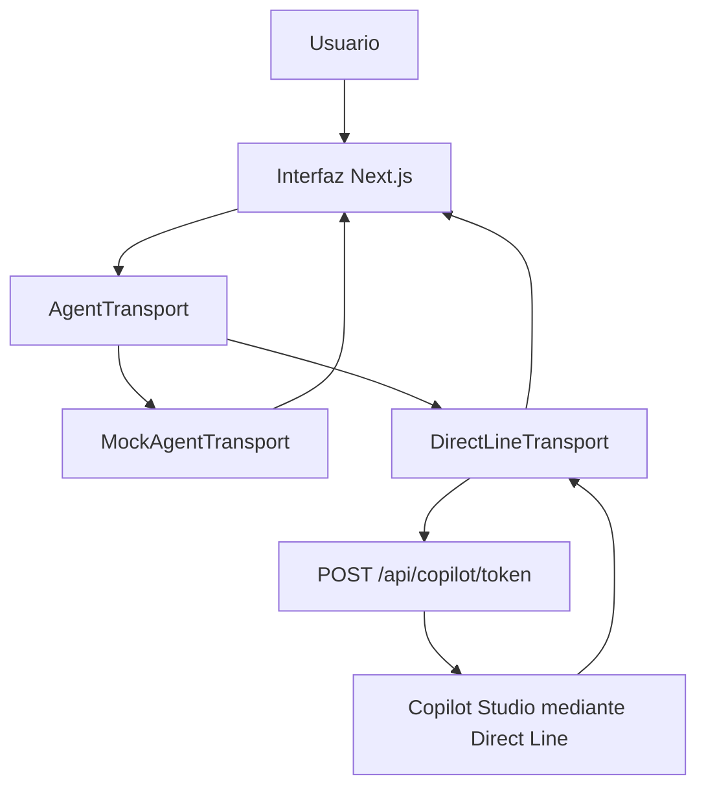

# Copilot Studio Rich UI

 [](https://www.typescriptlang.org/) [](https://nextjs.org/) [](https://react.dev/)

**Agentes de Copilot Studio que no parecen agentes de Copilot Studio.**

Copilot Studio Rich UI es una prueba de concepto que explora una forma distinta de integrar agentes: Microsoft Copilot Studio conserva el papel de backend inteligente, mientras que una aplicación de negocio hecha con React y Next.js controla completamente la experiencia que ve el usuario.

En vez de reducir la interacción a una ventana de chat, la aplicación combina conversación y componentes orientados a tareas. La integración actual permite al agente solicitar fechas, datos de pasajeros o una selección de camarote; la interfaz responde con controles específicos del dominio. La conversación forma parte de la experiencia, pero no la define por completo.

## Vista previa

> **Captura o GIF pendiente:** añade aquí una demostración del flujo de reserva cuando el proyecto disponga de material visual publicado.

## Características

- Interfaz de reservas con chat y componentes de interacción rica.
- Calendario de rango de fechas, selector de pasajeros y selector de camarotes activados por eventos del agente.
- Capa `AgentTransport` para desacoplar la interfaz de la implementación del agente.
- Dos modos de ejecución: `MockAgentTransport` para desarrollo local y `DirectLineTransport` para Copilot Studio.
- Eventos bidireccionales con uniones discriminadas de TypeScript y validación mediante Zod.
- Mensajes del agente sin HTML y validación del payload antes de actualizar la interfaz.
- Endpoint server-side para obtener el token de Direct Line sin exponer el endpoint de token al navegador.

## Arquitectura

La página de Next.js crea un transporte al iniciar. El transporte publica eventos de agente a interfaz y recibe mensajes o selecciones de la interfaz. Así, los componentes no necesitan conocer Direct Line ni los detalles de Copilot Studio.



El modo se determina con `NEXT_PUBLIC_AGENT_TRANSPORT`. Si el valor es `directline`, se usa `DirectLineTransport`; cualquier otro valor, o la ausencia de la variable, selecciona `MockAgentTransport`.

### Interacciones implementadas

`DirectLineTransport` muestra los mensajes del bot y procesa los eventos `ui.showDatePicker`, `ui.showTravelPartySelector` y `ui.showCabinSelector`. La interfaz envía `ui.datesSelected`, `ui.travelPartySelected` y `ui.cabinSelected` como actividades de Direct Line.

Los tipos y esquemas también declaran `ui.showFlights` y `ui.flightSelected`, y el componente `FlightCarousel` existe en el repositorio, pero no está integrado en `app/page.tsx`. Por ello, el flujo de vuelos no forma parte de la experiencia funcional actual. Consulta [el contrato de eventos](docs/event-contract.md) para distinguir los eventos implementados de los que están definidos para una integración futura.

## Stack tecnológico

- [Next.js 16](https://nextjs.org/) con App Router
- [React 19](https://react.dev/) y TypeScript estricto
- [Fluent UI React](https://react.fluentui.dev/)
- [Bot Framework Direct Line JS](https://www.npmjs.com/package/botframework-directlinejs)
- [Zod](https://zod.dev/) para validar contratos
- [Vitest](https://vitest.dev/) y ESLint

## Estructura del proyecto

```text
app/                    Rutas de Next.js, pantalla principal y rutas API
components/
	chat/                 Componentes conversacionales
	travel/               Calendarios, pasajeros, camarotes y componentes de vuelo no integrados
docs/                   Arquitectura, contrato de eventos y despliegue
lib/
	agent/                Transportes, adaptadores, tipos y esquemas
	mocks/                Datos y comportamiento para el modo simulado
tests/                  Pruebas unitarias de contratos y transportes
```

## Ejecutar en local

Requisitos: Node.js 20 o posterior y npm.

```bash
git clone https://github.com/AgenticWarlock/copilot-studio-rich-ui.git
cd copilot-studio-rich-ui
npm install
npm run dev
```

Abre `http://localhost:3000`. Los comandos disponibles son:

```bash
npm run lint
npm test
npm run build
npm start
```

## Usar `MockAgentTransport`

`MockAgentTransport` es el modo predeterminado. Permite desarrollar la interfaz, hacer demostraciones y ejecutar pruebas sin publicar ni configurar un agente de Copilot Studio.

Crea o actualiza `.env.local`:

```dotenv
NEXT_PUBLIC_AGENT_TRANSPORT=mock
```

Reinicia `npm run dev` después de cambiar variables de entorno. Para probar el flujo incluido, escribe `Quiero viajar a Roma`; el mock mostrará un selector de fechas. Al confirmar el rango, el mock emite `ui.showFlights`, pero la pantalla actual no monta el componente que presentaría esos vuelos.

## Conectar Copilot Studio mediante Direct Line

El modo real usa `DirectLineTransport`. El navegador solicita un token a la ruta local `POST /api/copilot/token`; esa ruta consulta `COPILOT_TOKEN_ENDPOINT` en el servidor y valida una respuesta con `token`, `expires_in` y `conversationId`.

1. Publica el agente y configura los eventos de Direct Line que están implementados: `ui.showDatePicker`, `ui.showTravelPartySelector` y `ui.showCabinSelector`. [El contrato](docs/event-contract.md) identifica las declaraciones aún no integradas en la pantalla.
2. Crea `.env.local` en la raíz del proyecto:

	 ```dotenv
	 COPILOT_TOKEN_ENDPOINT=https://<tu-endpoint-de-token>
	 NEXT_PUBLIC_AGENT_TRANSPORT=directline
	 ```

3. Si tu canal Direct Line no está en Europa, añade el dominio regional:

	 ```dotenv
	 NEXT_PUBLIC_DIRECT_LINE_DOMAIN=https://<tu-dominio-direct-line>/v3/directline
	 ```

4. Reinicia el servidor de desarrollo y abre la aplicación.

`COPILOT_TOKEN_ENDPOINT` no debe llevar el prefijo `NEXT_PUBLIC_`: solo se usa en el servidor. `.env.local` está excluido por Git. Para comprobar la configuración sin revelar secretos, consulta `GET /api/health`.

## Roadmap

- [x] Abstracción de transporte y flujo simulado para desarrollo local.
- [x] Conexión de Direct Line, obtención de token en servidor y adaptadores de actividades.
- [x] Validación de mensajes y de los eventos de fecha, pasajeros y camarote.
- [ ] Publicar captura o GIF del flujo completo.
- [ ] Integrar el carrusel de vuelos y completar el flujo `ui.showFlights` / `ui.flightSelected`.
- [ ] Ampliar ejemplos de configuración de Copilot Studio para los eventos pendientes.
- [ ] Añadir pruebas de integración con un entorno de Direct Line controlado.

## Contribuir

Las contribuciones son bienvenidas. Para proponer un cambio:

1. Abre un issue para discutir cambios de alcance o contrato.
2. Crea una rama con una modificación enfocada.
3. Ejecuta `npm run lint`, `npm test` y `npm run build`.
4. Envía un pull request explicando el comportamiento y las pruebas realizadas.

No incluyas endpoints, tokens ni valores de `.env.local` en issues, commits o pull requests.

## Licencia

Este repositorio no incluye actualmente un archivo de licencia. Todos los derechos quedan reservados hasta que el mantenedor publique una licencia explícita.
