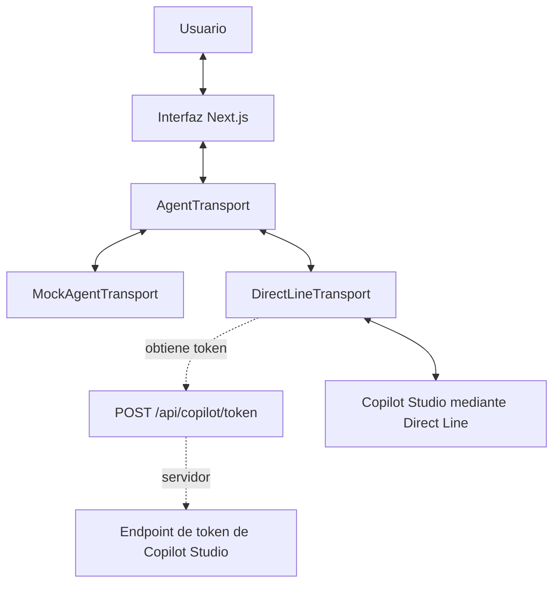

# Copilot Studio Rich UI


[](https://www.typescriptlang.org/)
[](https://nextjs.org/)
[](https://react.dev/)

> **Agentes de Copilot Studio que no parecen agentes de Copilot Studio.**

Siempre me ha gustado construir Power Apps que no parezcan Power Apps.

Este proyecto nace exactamente de la misma idea, pero aplicada a Copilot Studio.

Quería explorar qué ocurre cuando dejamos de pensar en un agente únicamente como una ventana de chat y empezamos a tratarlo como el cerebro de una aplicación mucho más rica.

En esta prueba de concepto, Microsoft Copilot Studio se encarga de la conversación, la inteligencia y la orquestación. La aplicación, construida con React y Next.js, controla la experiencia visual y muestra componentes específicos cuando el usuario los necesita: calendarios, selectores, formularios o tarjetas.

La conversación sigue siendo importante, pero ya no tiene que ser toda la experiencia.

## Vista previa

> **GIF o vídeo pendiente:** aquí irá una demostración del flujo completo de reserva.

## ¿Qué intenta demostrar este proyecto?

La pregunta detrás del repositorio es bastante sencilla:

> **¿Tiene que ser un agente únicamente una conversación?**

Creo que no.

Un agente puede entender la intención del usuario, decidir qué necesita y activar el componente más adecuado para completar una tarea.

Por ejemplo:

- Si necesita unas fechas, muestra un calendario.
- Si necesita información sobre los viajeros, muestra un selector.
- Si necesita que el usuario elija un camarote, presenta opciones visuales.
- Si necesita confirmar una acción, puede utilizar un componente pensado específicamente para ello.

Copilot Studio sigue siendo el backend inteligente, pero la interfaz deja de estar limitada por la experiencia de chat tradicional.

## Lo que incluye actualmente

- Una experiencia de reservas que combina chat y componentes ricos.
- Selector de fechas de ida y vuelta.
- Selector de pasajeros.
- Selector de camarotes.
- Una capa `AgentTransport` que desacopla la interfaz del agente.
- Dos modos de ejecución:
  - `MockAgentTransport` para desarrollo local.
  - `DirectLineTransport` para conectar Copilot Studio.
- Eventos bidireccionales entre el agente y la interfaz.
- Validación de los eventos con TypeScript y Zod.
- Obtención del token de Direct Line desde el servidor para no exponer el endpoint en el navegador.

## Cómo funciona

La idea principal es separar la experiencia visual de la forma en que se conecta el agente.

La interfaz trabaja con una abstracción llamada `AgentTransport`. Gracias a esto, los componentes no necesitan saber si están hablando con un agente real de Copilot Studio o con un flujo simulado para desarrollo.



El modo se determina mediante la variable `NEXT_PUBLIC_AGENT_TRANSPORT`.

- Si su valor es `directline`, la aplicación utiliza `DirectLineTransport`.
- Si la variable no existe o utiliza otro valor, se activa `MockAgentTransport`.

## Interacciones implementadas

Actualmente, `DirectLineTransport` procesa los siguientes eventos enviados por Copilot Studio:

- `ui.showDatePicker`
- `ui.showTravelPartySelector`
- `ui.showCabinSelector`

La interfaz devuelve las selecciones del usuario mediante:

- `ui.datesSelected`
- `ui.travelPartySelected`
- `ui.cabinSelected`

También están definidos los eventos `ui.showFlights` y `ui.flightSelected`, y existe un componente `FlightCarousel`. Sin embargo, ese flujo todavía no está conectado a la experiencia principal.

Puedes consultar [el contrato de eventos](docs/event-contract.md) para ver qué interacciones están disponibles y cuáles forman parte de futuras iteraciones.

## Stack tecnológico

- [Next.js 16](https://nextjs.org/) con App Router
- [React 19](https://react.dev/)
- TypeScript estricto
- [Fluent UI React](https://react.fluentui.dev/)
- [Bot Framework Direct Line JS](https://www.npmjs.com/package/botframework-directlinejs)
- [Zod](https://zod.dev/) para validar los contratos de eventos
- [Vitest](https://vitest.dev/)
- ESLint

## Estructura del proyecto

```text
app/                    Rutas de Next.js, pantalla principal y rutas API
components/
    chat/               Componentes conversacionales
    travel/             Calendarios, pasajeros, camarotes y componentes de vuelo
docs/                   Arquitectura, contrato de eventos y despliegue
lib/
    agent/              Transportes, adaptadores, tipos y esquemas
    mocks/              Datos y comportamiento del modo simulado
tests/                  Pruebas unitarias de contratos y transportes
```

## Ejecutar el proyecto en local

Necesitas Node.js 20 o posterior y npm.

```bash
git clone https://github.com/AgenticWarlock/copilot-studio-rich-ui.git
cd copilot-studio-rich-ui
npm install
npm run dev
```

Después, abre:

```text
http://localhost:3000
```

Otros comandos disponibles:

```bash
npm run lint
npm test
npm run build
npm start
```

## Probarlo sin Copilot Studio

`MockAgentTransport` es el modo predeterminado.

Permite probar la interfaz, desarrollar nuevos componentes y hacer demostraciones sin tener que publicar o configurar previamente un agente de Copilot Studio.

Crea o actualiza `.env.local`:

```dotenv
NEXT_PUBLIC_AGENT_TRANSPORT=mock
```

Después de cambiar una variable de entorno, reinicia `npm run dev`.

Para iniciar el flujo incluido, escribe:

```text
Quiero viajar a Roma
```

El mock mostrará el selector de fechas y continuará el flujo simulado.

Actualmente, el mock también puede emitir `ui.showFlights`, aunque el carrusel de vuelos todavía no está conectado a la pantalla principal.

## Conectar un agente real de Copilot Studio

El modo real utiliza `DirectLineTransport`.

El navegador solicita un token a la ruta local:

```text
POST /api/copilot/token
```

Esta ruta consulta `COPILOT_TOKEN_ENDPOINT` desde el servidor y devuelve al cliente la información necesaria para establecer la conexión con Direct Line.

### 1. Configura el agente

Publica el agente de Copilot Studio y configura los eventos que la interfaz reconoce actualmente:

- `ui.showDatePicker`
- `ui.showTravelPartySelector`
- `ui.showCabinSelector`

Consulta [el contrato de eventos](docs/event-contract.md) para conocer el formato de cada interacción.

### 2. Configura las variables de entorno

Crea `.env.local` en la raíz del proyecto:

```dotenv
COPILOT_TOKEN_ENDPOINT=https://<tu-endpoint-de-token>
NEXT_PUBLIC_AGENT_TRANSPORT=directline
```

### 3. Configura el dominio regional si es necesario

Si tu canal de Direct Line no está alojado en Europa, añade:

```dotenv
NEXT_PUBLIC_DIRECT_LINE_DOMAIN=https://<tu-dominio-direct-line>/v3/directline
```

### 4. Reinicia la aplicación

```bash
npm run dev
```

`COPILOT_TOKEN_ENDPOINT` no debe utilizar el prefijo `NEXT_PUBLIC_`, ya que solo se consume en el servidor.

El archivo `.env.local` está excluido de Git.

Para comprobar el estado de la configuración sin exponer secretos, puedes consultar:

```text
GET /api/health
```

## Estado actual

Este repositorio es una prueba de concepto y todavía está evolucionando.

La conexión con Copilot Studio mediante Direct Line está implementada, al igual que los componentes de fechas, pasajeros y camarotes.

El carrusel de vuelos y sus eventos ya están definidos, pero todavía no forman parte del flujo principal.

Prefiero dejar esto visible en lugar de presentar el proyecto como algo más completo de lo que realmente es.

## ¿Qué sigue?

Hay varias ideas que quiero seguir explorando:

- [x] Crear una abstracción de transporte.
- [x] Añadir un modo simulado para desarrollo local.
- [x] Conectar Copilot Studio mediante Direct Line.
- [x] Validar mensajes y eventos.
- [ ] Publicar una demostración visual del flujo completo.
- [ ] Integrar el carrusel de vuelos.
- [ ] Completar los eventos `ui.showFlights` y `ui.flightSelected`.
- [ ] Añadir más ejemplos de configuración de Copilot Studio.
- [ ] Crear nuevos componentes ricos.
- [ ] Añadir pruebas de integración con un entorno controlado de Direct Line.

## Contribuir

Las ideas, issues y pull requests son bienvenidos.

Para proponer un cambio:

1. Abre un issue para compartir la idea o discutir el alcance.
2. Crea una rama con una modificación concreta.
3. Ejecuta:

```bash
npm run lint
npm test
npm run build
```

4. Envía un pull request explicando qué cambia y cómo lo has probado.

No incluyas endpoints, tokens ni valores de `.env.local` en issues, commits o pull requests.

## Licencia

Este repositorio todavía no incluye una licencia open source.

Hasta que se publique un archivo `LICENSE`, todos los derechos permanecen reservados.

---

Espero que este repositorio sirva como inspiración para construir experiencias donde Copilot Studio sea el cerebro de la solución, pero no tenga que definir por completo cómo interactúa el usuario.

La conversación puede ser una parte de la experiencia.

No necesariamente toda la experiencia.
