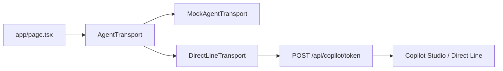

# Arquitectura

## Visión

La POC separa interfaz, contrato de eventos y transporte del agente. Esta separación permite alternar entre datos simulados y un agente de Copilot Studio sin acoplar los componentes de React a Direct Line.

## Capas

- `app/`: composición principal de pantalla y rutas API, incluido `POST /api/copilot/token`.
- `components/chat`: experiencia conversacional.
- `components/travel`: UI rica para fechas, vuelos, pasajeros y camarotes.
- `lib/agent`: interfaz `AgentTransport`, implementaciones, adaptadores y contratos.
- `lib/mocks`: datos simulados para el modo local.
- `tests/`: pruebas de contratos, mock y adaptadores de Direct Line.

## Flujo

`createAgentTransport()` selecciona `DirectLineTransport` cuando `NEXT_PUBLIC_AGENT_TRANSPORT=directline`; en cualquier otro caso selecciona `MockAgentTransport`.

En el flujo simulado, el usuario escribe `Quiero viajar a Roma`, el mock emite `ui.showDatePicker`, la interfaz devuelve `ui.datesSelected` y el mock responde con `ui.showFlights`. El mismo contrato permite que un agente real active componentes ricos mediante actividades de Direct Line.

## Integración de Direct Line

`DirectLineTransport` está implementado. Solicita un token a `POST /api/copilot/token`, que usa `COPILOT_TOKEN_ENDPOINT` solo en el servidor y valida la respuesta antes de devolverla al navegador. El dominio de Direct Line usa Europa por defecto y puede personalizarse con `NEXT_PUBLIC_DIRECT_LINE_DOMAIN`.
